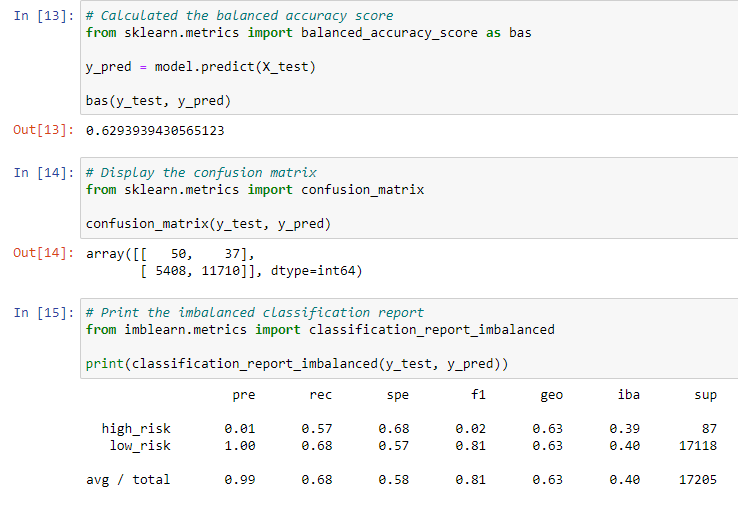
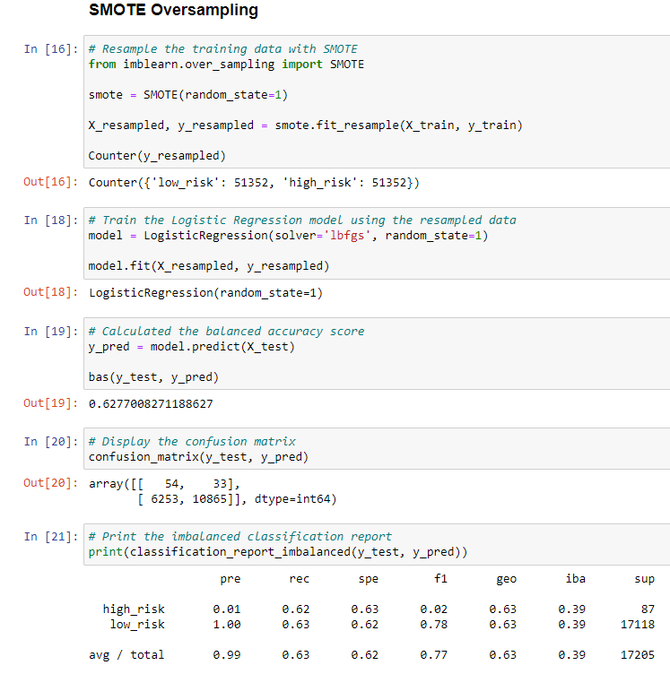
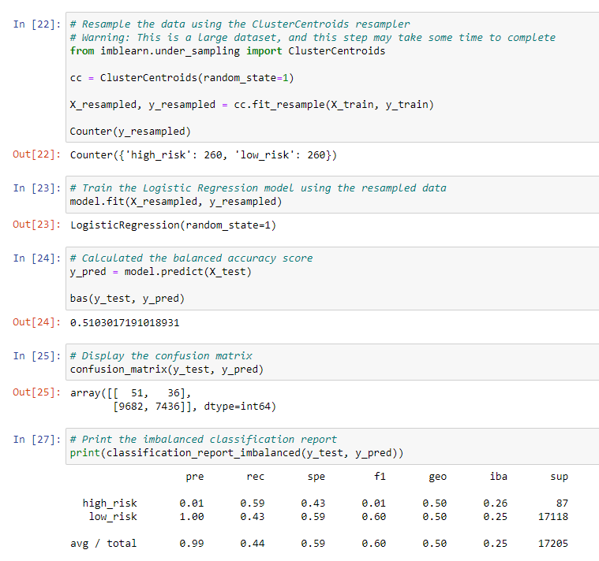
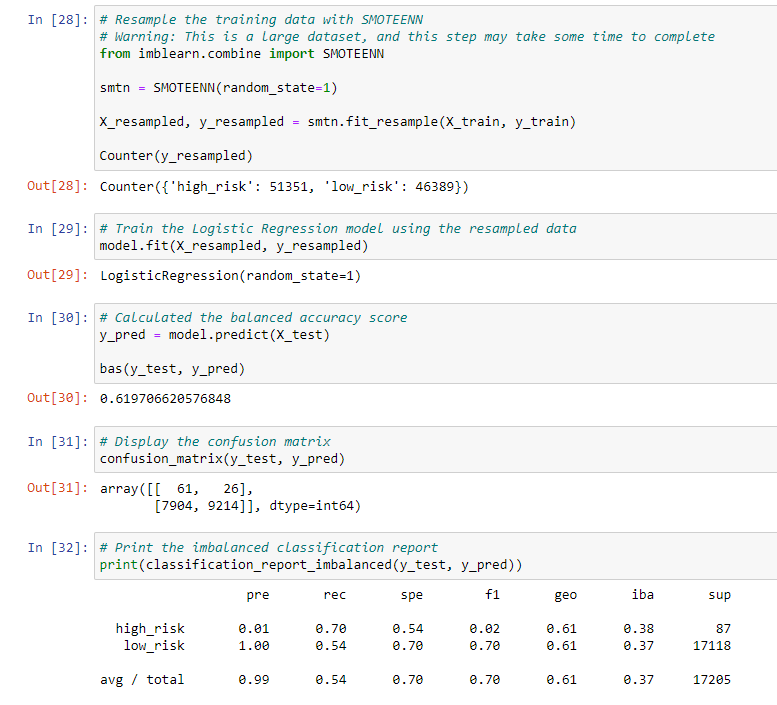
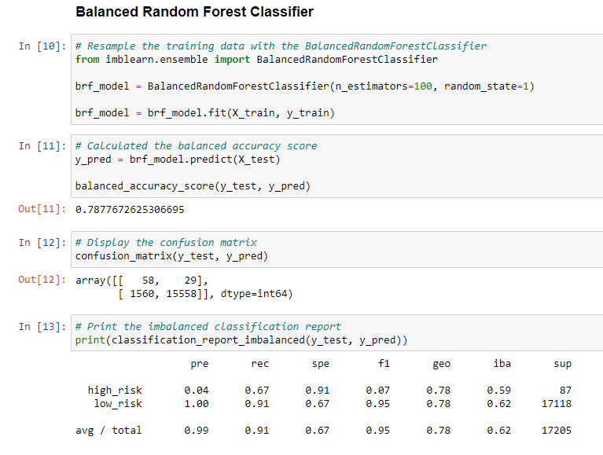
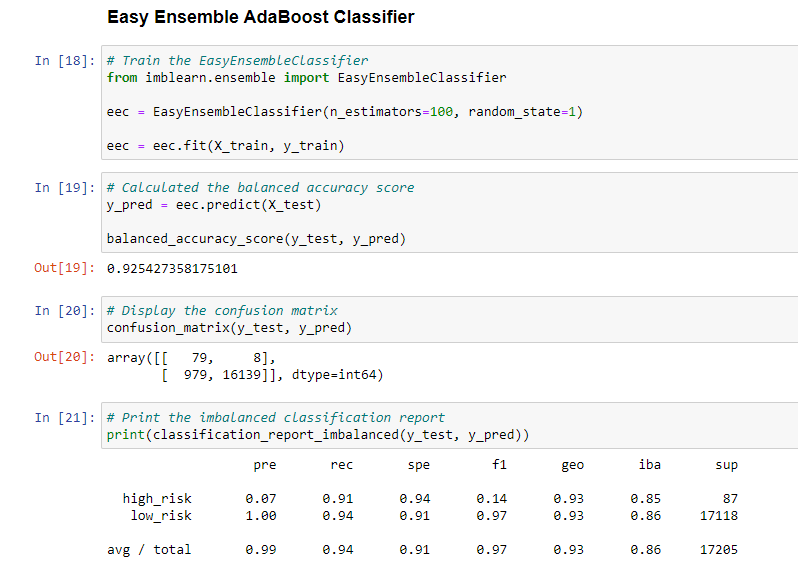

# Credit_Risk_Analysis

## Overview
Fast Lending wants to use supervised machine learning to predict credit risk. They believe that this can lead to better loans & lower default rates. Use machine learning models to analyze the consumer credit profiles dataset.

## Results
### Naive Random Oversampling

- Balanced Accuracy Score: 0.6293939430565123
- Precision Score: 0.99
- Recall Score: 0.68

### SMOTE Oversampling

- Balanced Accuracy Score: 0.6277008271188627
- Precision Score: 0.99
- Recall Score: 0.63

### Cluster Centroid Undersampling

- Balanced Accuracy Score: 0.5103017191018931
- Precision Score: 0.99
- Recall Score: 0.44

### SMOTEENN Combination Over & Undersampling

- Balanced Accuracy Score: 0.619706620576848
- Precision Score: 0.99
- Recall Score: 0.54

### Balanced Random Forest Classifier

- Balanced Accuracy Score: 0.7877672625306695
- Precision Score: 0.99
- Recall Score: 0.91

### Easy Ensemble Adaboost Classifier

- Balanced Accuracy Score: 0.925427358175101
- Precision Score: 0.99
- Recall Score: 0.94

## Summary
- Every model had a precision score of 0.99, but varying BAS (Balanced Accuracy Score) & Recall scores.
- The resampling models had a BAS range of 0.51 to 0.62 and recall scores from 0.44 to 0.68.
- The ensemble models had much better precision and recall scores.
  - Balanced Random Forest model had a BAS of 0.78 and a recall score of 0.91.
  - The Easy Ensemble Adaboost model had a BAS of 0.92 and a recall score of 0.94, both were the highest of all 6 models.
- Going forward I would recommend training and testing more ensemble models, rather than the more inaccurate resampling models.
